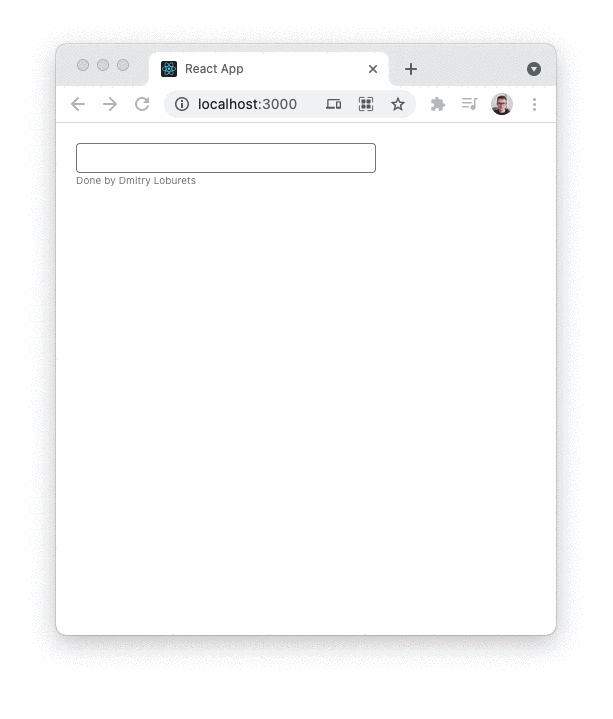

# Pure autocomplete in 100 minutes ✨

This is a challenge to test how much I can do within 100 minutes.

The task was to make the autocomplete using only pure react installation without any other libraries.

Naturally, no LLMs involved — they weren’t even in use back in 2021 when this repo was created.

## What I get 💡



If you want to check the code, they are just a few files to read:

- [App.js](./src/App.js)
- [App.css](./src/App.css)
- [retrieveOptions.js](./src/data/retrieveOptions.js) - this file imitates responses from API

## How to run 🛠️

```shell
yarn install && yarn start
```

## What should be done the other way? 🕵️

Oh, a lot, they are just 100 minutes!

1. Add debounce: not create new requests while the user just typing
2. Care about a11y, especially navigation through the elements using keyboard arrows
3. Split code from App.js to be in a separate component
4. It is better to use the functional components nowadays. But it was part of the task to use the classes
5. Add tests using `@testing-library/react`
6. Styling is a very basic one, it is better to use something like styled-components or jss
